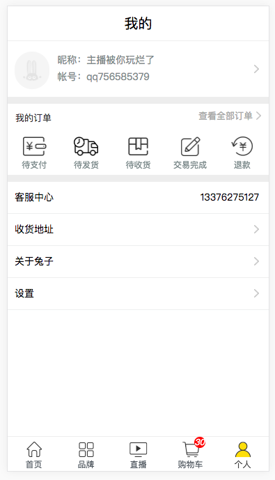

# tzshop

## 效果图手机扫二维码观看
 




```
vue init webpack your-projectName
```
## 安装插件
```
# if use sass
npm install sass --save-dev
npm install sass-loader --save-dev
npm install node-sass --save-dev

# if use stylus
npm install stylus --save-dev
npm install stylus-loader --save-dev

npm install axios --save-dev
npm install vuex -D

# 轮播图插件
npm i vue-awesome-swiper -S
```

``` bash
# install dependencies
npm install

# serve with hot reload at localhost:8080
npm run dev

# build for production with minification
npm run build

# build for production and view the bundle analyzer report
npm run build --report

# run unit tests
npm run unit

# run e2e tests
npm run e2e

# run all tests
npm test
```

### eslint配置
```
// semi always强制加分号,必须加分号，不然报错
'semi': ['error','always']
```

For detailed explanation on how things work, checkout the [guide](http://vuejs-templates.github.io/webpack/) and [docs for vue-loader](http://vuejs.github.io/vue-loader).
